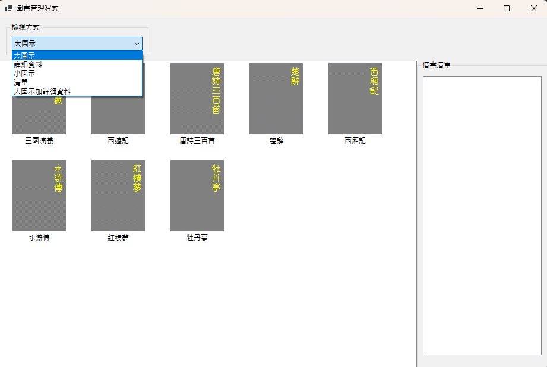

# BookListView 圖書管理程式

本專案為一個基於 Windows Forms 發展的圖書管理視窗應用程式 。透過 ListView 控制項，展示如何以多種不同的檢視形式（如大圖示、詳細資料等）呈現圖書資訊 ，並提供使用者透過雙擊快速將書籍加入借書清單的互動功能 。

## 視窗截圖

## 操作指引

1. 使用 Visual Studio 開啟 `BookListView.sln`。
2. 按 `F5` 或「開始偵錯」執行程式。
3. 視窗左側會顯示 8 本書籍與封面圖片。
4. 在上方「檢視方式」下拉選單切換顯示模式：
   - 大圖示
   - 詳細資料
   - 小圖示
   - 清單
   - 大圖示加詳細資料
5. 在書籍上按兩下會跳出「確定要借閱嗎？」確認視窗。
6. 選擇「是」後，書名會加入右側「借書清單」。
7. 已加入借書清單的書籍再次按兩下時，不會重複新增。

## 使用的技術與控制項

- C# Windows Forms
- `.NET 10.0-windows`
- `ListView`：顯示圖書清單、書名、作者、類別與封面圖示。
- `ImageList`：提供大圖示 `90x120` 與小圖示 `15x20`。
- `ComboBox`：切換 `ListView` 的 `LargeIcon`、`Details`、`SmallIcon`、`List`、`Tile` 檢視模式。
- `GroupBox`：區分「檢視方式」與「借書清單」區塊。
- `ListBox`：顯示已借閱書籍。
- `Dock` 版面配置：讓工具列、圖書清單與借書清單可隨視窗大小調整。
- `ItemActivate` 事件：設定 `Activation = TwoClick`，使用者雙擊書籍時觸發借閱確認。
